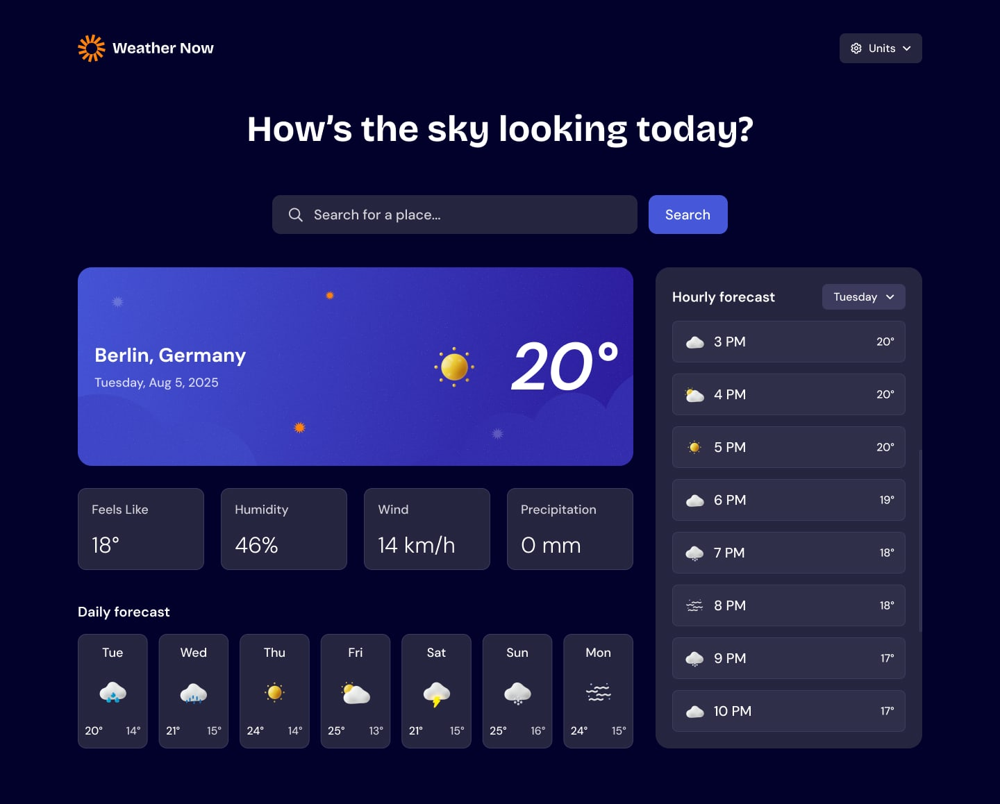

# Geostorm 🌦️

A weather app built with the Next.js App Router — real-time conditions, hourly and 7-day forecasts, automatic location detection, and unit preferences that persist in the URL.

**[Live demo →](https://geostorm-weathernow.vercel.app/)**



## Features

- **Automatic location detection** — requests the user's device location on load, with a graceful fallback to a default city if permission is denied or unavailable
- **City search** — debounced search-as-you-type with a dropdown of matching results, plus explicit empty and no-results states
- **Unit switching (metric / imperial)** — toggling temperature, wind speed, or precipitation units updates the URL as query params, so preferences survive a refresh or a shared link
- **Skeleton loading states** — every data-dependent section (location panel, metric cards, daily forecast, hourly forecast) has a matching skeleton, so the layout doesn't jump as data arrives
- **Error handling** — a dedicated error state with retry, rather than a silent failure or blank screen

## Tech stack

| | |
|---|---|
| Framework | [Next.js 16](https://nextjs.org) (App Router, Turbopack) |
| UI library | [React 19](https://react.dev) |
| Data fetching / caching | [TanStack Query](https://tanstack.com/query) |
| Component primitives | [Base UI](https://base-ui.com) |
| Styling | CSS Modules |
| Weather data | [Open-Meteo](https://open-meteo.com) (forecast + geocoding, no API key required) |
| Icons | [Lucide](https://lucide.dev) |

## Architecture notes

- **`data/api/`** — thin fetch wrappers around the Open-Meteo endpoints (forecast, reverse geocoding, city search), kept separate from React so they're easy to test or swap out
- **`data/queries/`** — TanStack Query hooks (`useWeather`, `useDeviceLocation`, `useReverseGeocode`, `useCitySearch`) that wrap the API layer with caching, loading, and error states
- **`hooks/useUnits.ts`** — reads and writes unit preferences directly to and from the URL's query string via `useSearchParams` / `router.replace`, so unit state is shareable and refresh-proof without any client-side storage
- **`components/`** — presentational components paired 1:1 with their CSS Module, plus a `skeletons/` subfolder mirroring the components that need loading placeholders

## Getting started

```bash
git clone https://github.com/ocodner-7/geostorm.git
cd geostorm
npm install
npm run dev
```

Open [http://localhost:3000](http://localhost:3000). No environment variables or API keys are needed — Open-Meteo's endpoints are public.

## Design reference

Design mockups for each state (metric/imperial, loading, hover, focus, dropdown, error, no-results) are in [`public/design/`](./public/design), used as the source of truth during build.